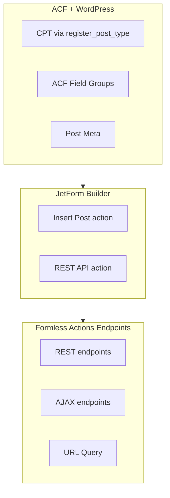

# JetForm Builder + ACF

**JetEngine не требуется.** Actions JetForm Builder (Save Form Record, Insert Post, REST API и др.) работают с любым WordPress CPT и meta-полями. ACF покрывает custom fields и отношения.

---

## Full Workflow: форма на фронте + записи в админке

### 1. Создание формы (программно)

```bash
docker compose exec wordpress-new wp eval-file wp-content/mu-plugins/cli/create-callback-form.php --allow-root
```

Или через **JetForm Builder → Add New** вручную.

### 2. Сохранение заявок в админке (Save Form Record)

1. **JetForm Builder → Forms** → открыть форму
2. **Post Submit Actions** → **Add Action** → **Save Form Record**
3. Опционально: включить «Store the IP address and other request headers»
4. **Update** формы

Записи появятся в **JetForm Builder → Form Records** (меню админки).

### 3. Вывод формы на фронте

**Shortcode:** `[jet_fb_form form_id="750"]` (750 — ID формы)

**Gutenberg:** блок **JetForm Builder → Insert Form** → выбор формы

**PHP:** `echo do_shortcode( '[jet_fb_form form_id="750"]' );`

### 4. Дополнительные actions (по необходимости)

- **Send Email** — уведомление на почту
- **Insert Post** — запись в свой CPT (см. раздел Mapping)
- **REST API** — отправка в Next.js API

---

## Save Form Record (встроенное хранение)

| Таблица | Назначение |
|---------|------------|
| `wp_jet_fb_records` | ID, referrer, status, IP |
| `wp_jet_fb_records_fields` | Значения полей формы |
| `wp_jet_fb_records_actions` | Статусы actions |
| `wp_jet_fb_records_errors` | Ошибки |

Пароли в записи не сохраняются.

---

## When to Use

**Используй этот skill когда:**

- Создаёшь формы для создания/редактирования записей CPT с ACF-полями
- Нужно сохранять заявки в WordPress админке (Form Records)
- Нужен маппинг полей формы на post meta (ACF)
- Реализуешь отправку данных без визуальной формы (REST, AJAX, URL Query)
- Подключаешь Jet Form Builder Formless Actions Endpoints

**Не для:**

- Insert CCT, JetEngine Relations (требуют JetEngine)
- Форм только с email/уведомлениями без записи в БД (можно, но не фокус skill)

---

## Architecture



---

## ACF + CPT Setup

CPT регистрируется через `register_post_type()` (например в mu-plugins). ACF Field Group привязывается к этому post type.

**Пример регистрации CPT:**

```php
// wp-content/mu-plugins/your-structure.php
add_action('init', function() {
    register_post_type('booking', [
        'labels'     => ['name' => 'Заявки', 'singular_name' => 'Заявка'],
        'public'     => true,
        'supports'   => ['title', 'editor'],
        'menu_icon'  => 'dashicons-feedback',
    ]);
});
```

**ACF Field Group** — создаётся в админке или через JSON/код, с полями для нужных данных. Имена полей (field name) становятся meta keys и используются в JetForm Builder при маппинге.

---

## JetForm Builder Actions (без JetEngine)

| Action | Назначение |
|--------|------------|
| **Save Form Record** | Записи в JetForm Builder → Form Records (встроенно) |
| **Insert Post** | Создание постов CPT, маппинг на meta (ACF) |
| **REST API** | Да — отправка данных на внешний endpoint |
| **Insert CCT** | Нет — CCT это JetEngine |
| **Relations preset** | Нет — Relations это JetEngine. ACF Relationship заполняется через meta или кастомной логикой |

### Insert Post

- В форме добавляешь action **Insert Post**
- Выбираешь **Post Type** (твой CPT)
- В **Field Map** связываешь поля формы с полями поста:
  - **Post field** (title, content, excerpt и т.д.) — стандартные поля поста
  - **Meta field** — сюда подставляешь **ACF field name** (meta key), например `phone`, `email`, `related_doctor`

Значения полей формы будут записаны в `post_meta` с указанными ключами; ACF их подхватит по тем же именам.

### REST API

- Action **REST API** — URL, метод, при необходимости маппинг полей формы в body/query
- Удобно для отправки данных в Next.js API route или внешний сервис

---

## Formless Endpoints

**Плагин:** Jet Form Builder Formless Actions Endpoints

Даёт вызывать те же actions (в т.ч. Insert Post, REST API) **без визуальной формы**:

- **REST** — POST/GET на зарегистрированный endpoint
- **WP Ajax** — через `admin-ajax.php`
- **URL Query** — передача параметров в query string

Использование: настрой Form в JetForm Builder с нужными actions, затем в настройках Formless создаётся endpoint по slug формы. Данные передаются в теле запроса или query и маппятся на поля формы по имени.

---

## Mapping Form → ACF

1. В ACF Field Group для CPT задай **Field Name** (например `client_phone`, `client_email`).
2. В JetForm Builder в Insert Post → **Field Map** добавь строки:
   - **Meta key** = этот же Field Name (`client_phone`, `client_email`)
   - **Form field** = макрос поля формы, например `%field_name%` или выбранное поле из списка.
3. При отправке формы значения попадут в `post_meta` с этими ключами; ACF будет показывать и отдавать их в REST/GraphQL по своей схеме.

Для **Relationship** ACF: через Insert Post обычно записывается ID поста в meta (одно значение или serialized array — зависит от настроек ACF). Либо используй кастомный код после submit (hook JetForm Builder) и вызывай `update_field()` для relationship.

---

## Quick Reference

| Плагин | Назначение |
|--------|------------|
| **JetForm Builder** | Построитель форм, actions: Insert Post, REST API и др. |
| **Jet Form Builder Formless Actions Endpoints** | REST/AJAX/URL endpoints без визуальной формы |
| **ACF Pro** | CPT fields, Repeater, Relationship; meta хранится в post_meta |

---

## Troubleshooting

**Поля не сохраняются в ACF**

- Проверь, что в Insert Post → Field Map **Meta key** совпадает с ACF **Field Name** (не label).
- Убедись, что Field Group привязан к нужному Post Type.

**Formless endpoint не создаётся / 404**

- Убедись, что плагин Formless Actions Endpoints активен и форма сохранена.
- Проверь permalinks (должны быть не default).

**Relationship не заполняется**

- Insert Post по умолчанию пишет meta как скаляр/массив ID. Для сложных relationship может понадобиться hook на успешную отправку формы и вызов `update_field('relationship_field', $ids, $post_id)`.

---

## Создание форм через Cursor (программно)

### Workflow: форма без ручной работы в WP

1. **Опиши форму в чате** — например: «Форма: телефон, кнопка Отправить».
2. **AI генерирует** конфиг и добавляет скрипт в `wp-content/mu-plugins/cli/`.
3. **Запусти:**
   ```bash
   docker compose exec wordpress-new wp eval-file wp-content/mu-plugins/cli/create-callback-form.php --allow-root
   ```
4. **Настрой actions** в админке: Save Form Record, Send Email и т.д.

### Формат конфига

```php
$config = [
    'title'  => 'Контактная форма',
    'slug'   => 'contact-form',
    'fields' => [
        [ 'type' => 'text',   'name' => 'name',    'label' => 'Имя',       'required' => true ],
        [ 'type' => 'email',  'name' => 'email',   'label' => 'Email',     'required' => true ],
        [ 'type' => 'tel',    'name' => 'phone',   'label' => 'Телефон' ],
        [ 'type' => 'textarea', 'name' => 'message', 'label' => 'Сообщение', 'required' => true ],
        [ 'type' => 'checkbox', 'name' => 'consent', 'label' => 'Согласие на обработку ПД', 'required' => true ],
        [ 'type' => 'submit', 'label' => 'Отправить' ],
    ],
];
```

Для форм с персональными данными (headless) — обязательно добавлять поле `consent` (checkbox, required). Default value: `false` (не отмечен).

### Поддерживаемые типы полей

| type     | Блок JetFormBuilder     |
|----------|-------------------------|
| text     | jet-forms/text-field    |
| email    | jet-forms/text-field    |
| tel      | jet-forms/text-field   |
| password | jet-forms/text-field   |
| textarea | jet-forms/textarea-field |
| number   | jet-forms/number-field  |
| select   | jet-forms/select-field (options: value=>label) |
| checkbox | jet-forms/checkbox-field (default: false) |
| radio    | jet-forms/radio-field   |
| hidden   | jet-forms/hidden-field  |
| submit   | jet-forms/submit-field  |

### Альтернатива: JetFormBuilder AI (в WP)

- **JetFormBuilder → Add New** → кнопка «Generate Form with AI» (или Generate via AI в Welcome block).
- Промпт на английском, до 10 запросов/месяц.
- AI генерирует поля, post-submit actions настраиваются вручную.

---

## Headless REST flow (Next.js)

Для headless архитектуры shortcode `[jet_fb_form]` не работает. Используется **Formless REST Endpoint** + Next.js API-прокси:

1. **Создание формы** — программно через `unident_create_jetform()` или вручную
2. **Endpoint в WP** — JetForm Builder → Endpoints → Add route: Related Form, Action type «REST API Endpoint», Route (например `callback`). URL: `{WP_URL}/wp-json/jet-fb/v1/callback`
3. **Конфиг** — `nextjs/src/data/forms.json` с описанием полей
4. **Next.js** — `CallbackForm` отправляет на `/api/jetform-submit`, который проксирует на WordPress

### Пример запроса (fetch)

```ts
const res = await fetch("/api/jetform-submit", {
  method: "POST",
  headers: { "Content-Type": "application/json" },
  body: JSON.stringify({ phone: "+7 900 123-45-67" }),
});
```

### Пример curl (напрямую к WP)

```bash
curl -X POST "http://localhost:8002/wp-json/jet-fb/v1/callback" \
  -H "Content-Type: application/json" \
  -d '{"phone": "+7 900 123-45-67"}'
```

### Form Request Args

В JetForm Builder → Settings: Request key и Request value — опциональная защита. Если endpoint возвращает ошибку валидации, добавь в body или query `requestKey` и `requestValue` из настроек формы.

---

## Compliance: Роспатребнадзор, Минздрав

Для форм с персональными данными обязателен блок согласия:

- **Checkbox + текст в одну строку** — checkbox слева, текст справа
- **Checkbox по умолчанию** — не нажата (unchecked)
- **Текст:** «Отправляя заявку, вы даете согласие на обработку персональных данных и соглашаетесь с Политикой в отношении обработки и защиты персональных данных»
- **Ссылки** на документы — кликабельные

При создании форм для headless добавлять поле `consent` (checkbox, required) в конфиг. В Next.js CallbackForm — валидация через Zod, `defaultValues: { consent: false }`.

---

## References

- Программное создание: `wp-content/mu-plugins/jetform-create-from-json.php`, `wp-content/mu-plugins/cli/create-callback-form.php`
- Next.js: `nextjs/src/app/api/jetform-submit/route.ts`, `nextjs/src/components/forms/callback-form.tsx`, `nextjs/src/data/forms.json`
- Skill headless: `.cursor/skills/jetform-headless-forms/SKILL.md`
- Правила проекта: `.cursor/rules/wordpress.mdc`, ACF skills в `.cursor/skills/`
